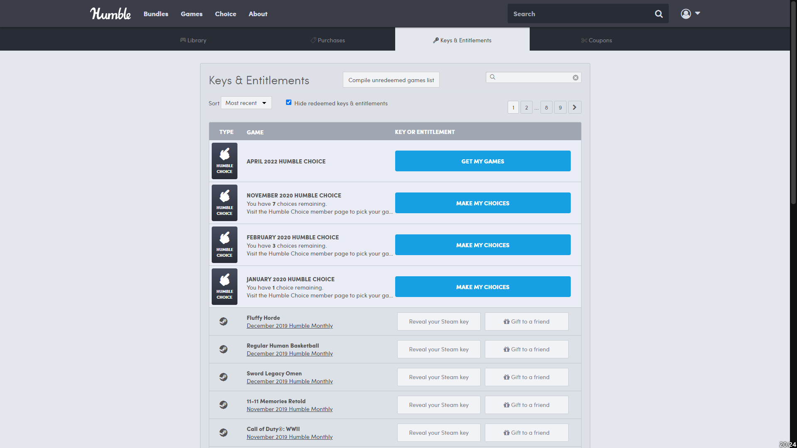

# HumbleBundle - Unredeemed Game List Compiler

## Description

Compiles a list of the unredeemed games.

## Usage

1. Navigate to https://www.humblebundle.com/home/keys.
2. Press the new "Compile unredeemed games list" button.
3. A file named `unredeemed-humblebundle-games-list.html` will be generated and downloaded.

## Preview

## Installation

- [UserJS](./humblebundle-unredeemed-game-list-compiler.user.js) (press the "Raw" button to install).